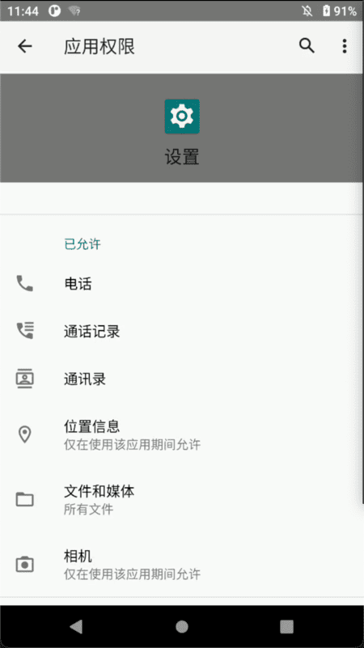
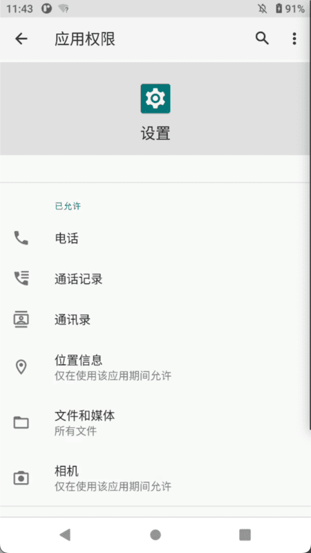
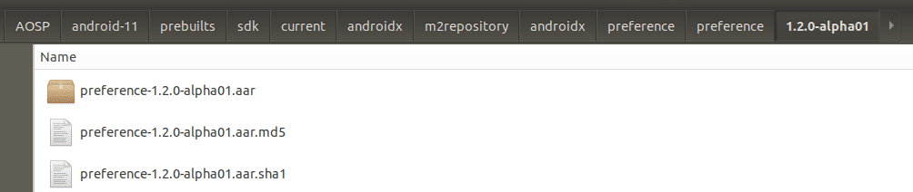
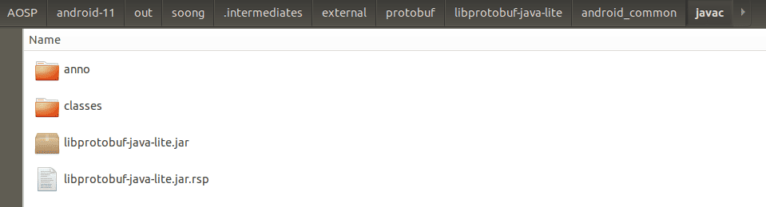
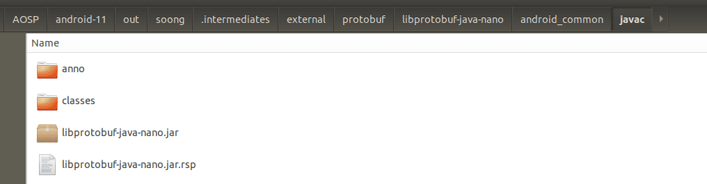
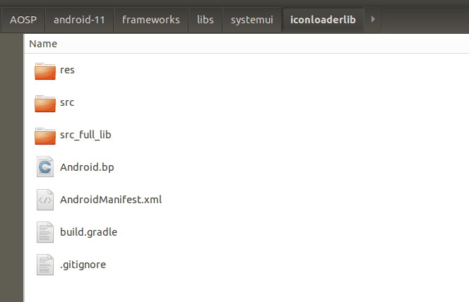
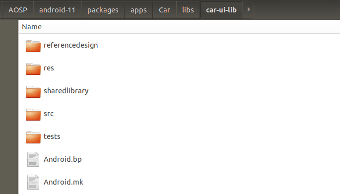

## PermissionController from android-11.0.0_r10
### PermissionController 脱离源码在Android Studiod的编译

### 支持说明
* 不试图改变项目本身的目录结构，而是通过添加额外的配置和依赖构建Gradle环境支持
* 运行的效果会与原生的有样式上的差异，这是由于AS编译出来的主题样式与系统的默认的样式不同（如下图）


###  pixel2运行效果：Gradle编译 VS Android.bp编译
---
 

---


## 执行步骤
#### 第一步：查询PermissionController所处的位置，是否可以直接push
```
adb shell pm path com.android.permissioncontroller  
```

### 第二步：由于高版本PermissionController已经换成APEX进行迭代更新，所以无法对该目录进行push替换，需要自己创建系统路径，再对它进行覆盖。

```
adb root

adb remount

adb shell mkdir /system/priv-app/PermissionController

adb push PermissionController.apk /system/priv-app/PermissionController/

adb reboot
```

### PS: 如果系统出现在remount之后起不来，可能是出现avc权限问题，这时候可以执行一下操作
```
adb shell setenforce 0
```

## 构建步骤

### Step1：引入静态依赖
##### @framework.jar:
```
// AOSP/android-11/out/target/common/obj/JAVA_LIBRARIES/framework_intermediates/classes-header.jar
compileOnly files('libs/framework.jar')
```


##### @preference-1.2.0-alpha01.aar:
```
// AOSP/android-11/prebuilts/sdk/current/androidx/m2repository/androidx/preference/preference/1.2.0-alpha01/preference-1.2.0-alpha01.aar
implementation(name: 'preference-1.2.0-alpha01', ext: 'aar')
```



###### ps: androidx.preference 不容易通过以下方式去引用，故换成静态
```
## implementation 'androidx.preference:preference:1.2.0-alpha01'
```

##### @libprotobuf-java-lite.jar:
```
// AOSP/android-11/out/soong/.intermediates/external/protobuf/libprotobuf-java-lite/android_common/javac/libprotobuf-java-lite.jar
compileOnly files('libs/libprotobuf-java-lite.jar')
```



##### @libprotobuf-java-nano.jar:
```
// AOSP/android-11/out/soong/.intermediates/external/protobuf/libprotobuf-java-nano/android_common/javac/libprotobuf-java-nano.jar
implementation files('libs/libprotobuf-java-nano.jar')
```



##### @permissioncontroller-statsd.jar:
```
// AOSP/android-11/out/soong/.intermediates/packages/apps/PermissionController/permissioncontroller-statsd/android_common_com.android.permission/javac/permissioncontroller-statsd.jar
implementation files('libs/permissioncontroller-statsd.jar')
```


### Step2：引入Module
###### 需要将具体路径下的代码直接导入到项目中作为Module依赖, 构建的时候可以直接通过implementation project引用，或者也可以gradle build生成aar,再放置到libs文件夹中，作为静态包使用。

##### @iconloaderlib: 
```
// AOSP/android-11/frameworks/libs/systemui/iconloaderlib
implementation project(':iconloaderlib')
```



##### @car-ui-lib: 
```
// AOSP/android-11/packages/apps/Car/libs/car-ui-lib
implementation project(':car-ui-lib')
```



##### @SettingsLib: 
```
// AOSP/android-11/frameworks/base/packages/SettingsLib
implementation project(':SettingsLib:HelpUtils')
implementation project(':SettingsLib:RestrictedLockUtils')
implementation project(':SettingsLib:AppPreference')
implementation project(':SettingsLib:SearchWidget')
implementation project(':SettingsLib:LayoutPreference')
implementation project(':SettingsLib:BarChartPreference')
implementation project(':SettingsLib:ActionBarShadow')
implementation project(':SettingsLib:ProgressBar')
implementation project(':SettingsLib:Utils')
```


### Step3：将proto文件单独抽取出来，作为独立的目录进行引用，因为原路径下的proto指定了基于AOSP下的路径，会导致编译时引用失败。
```
sourceSets {
    main {
	......
	proto.srcDirs = ['protos']
	......
    }
}
```

## 生成platform.keystore默认签名

在AOSP/android-11/build/target/product/security路径下找到签名证书，并使用 [keytool-importkeypair](https://github.com/getfatday/keytool-importkeypair) 生成keystore,
执行如下命令：  

```
./keytool-importkeypair -k platform.keystore -p 123456 -pk8 platform.pk8 -cert platform.x509.pem -alias platform
```

并将以下代码添加到gradle配置中：

```
    signingConfigs {
        platform {
            storeFile file("platform.keystore")
            storePassword '123456'
            keyAlias 'platform'
            keyPassword '123456'
        }
    }

    buildTypes {
        release {
            debuggable false
            minifyEnabled false
            signingConfig signingConfigs.platform
        }

        debug {
            debuggable true
            minifyEnabled false
            signingConfig signingConfigs.platform
        }
    }
```

### PS:
##### 应用在编译之前，Gradle脚本会主动删除并忽略掉overlayable.xml参与编译
```
applicationVariants.all { variant ->
    variant.mergeResourcesProvider.configure {
        doFirst {
            def filePath = 'res/values/overlayable.xml'
            delete file(filePath)
            exec {
                commandLine 'git', 'update-index', '--assume-unchanged', filePath
            }
        }
    }
}
```  

##### 忽略和还原单个文件
``` 
git update-index --assume-unchanged $path
git update-index --no-assume-unchanged $path
``` 

---

### 关联项目
* [Settings](https://github.com/siren-ocean/Settings)
* [Launcher3](https://github.com/siren-ocean/Launcher3)
* [DocumentsUI](https://github.com/siren-ocean/DocumentsUI)
* [Camera2](https://github.com/siren-ocean/Camera2)
* [SystemUI](https://github.com/siren-ocean/SystemUI)
