# English | [中文文档](README.cn.md)
## PermissionController from android-14.0.0_r67
### Building PermissionController outside AOSP source in Android Studio

### Support Notes
* Instead of changing the project's directory structure, we add additional configurations and dependencies to build Gradle environment support

## Building with Command Line
### Environment Requirements
*  Gradle 8.7
*  JDK version 17

```
# Setup build environment
gradle wrapper

# Build and package
./gradlew assemble
```


## Building in Android Studio
### Recommended
*  Android Studio Koala & JDK version 17

#### Step 1: Execute Build APK in Android Studio to compile the APK

#### Step 2: Create system directory and push the APK to that directory.
### PS: Since newer versions of PermissionController have been migrated to APEX for iterative updates, the directory cannot be replaced via push. You need to create a system path yourself and then overwrite it. You can check if PermissionController is in an APEX directory using the following command.
```
adb shell pm path com.android.permissioncontroller  
```


####  Create /system/priv-app/PermissionController directory and overwrite the APEX implementation.
```
adb root

adb remount

adb shell mkdir /system/priv-app/PermissionController

adb push PermissionController.apk /system/priv-app/PermissionController/

```

#### Step 3: Push permission file to etc directory
```
adb push com.android.permissioncontroller.xml /system/etc/permissions/

adb reboot
```

## Build Steps

### Step 1: Add Static Dependencies
##### @framework.jar:
```
// android-14/out/target/common/obj/JAVA_LIBRARIES/framework_intermediates/classes-header.jar
compileOnly files('libs/framework.jar')
```


##### @android.car-stubs.jar:
```
// android-14/out/soong/.intermediates/packages/services/Car/car-lib/android.car-stubs/android_common/e18b8e8d84cb9f664aa09a397b08c165/turbine/android.car-stubs.jar
compileOnly files('libs/android.car-stubs.jar')
```
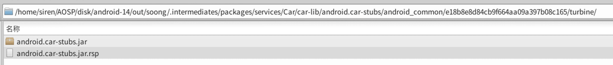


##### @android.permission.flags-aconfig-java.jar:
```
// android-14/out/soong/.intermediates/frameworks/base/android.permission.flags-aconfig-java/android_common/javac/android.permission.flags-aconfig-java.jar
implementation files('libs/android.permission.flags-aconfig-java.jar')
```
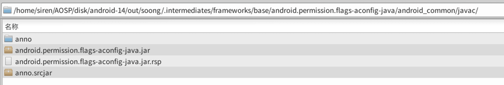


##### @modules-utils-build_system.jar:
```
// android-14/out/soong/.intermediates/frameworks/libs/modules-utils/java/com/android/modules/utils/build/modules-utils-build_system/android_common/javac/modules-utils-build_system.jar
implementation files('libs/modules-utils-build_system.jar')
```
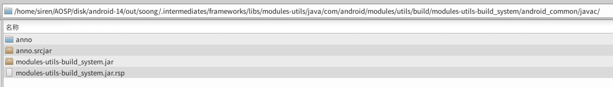

##### @permissioncontroller-statsd.jar:
```
// android-14/out/soong/.intermediates/packages/modules/Permission/PermissionController/permissioncontroller-statsd/android_common_apex30/javac/permissioncontroller-statsd.jar
implementation files('libs/permissioncontroller-statsd.jar')
```
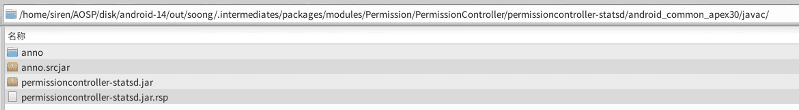

##### @permissions-aconfig-flags-lib.jar:
```
// android-14/out/soong/.intermediates/packages/modules/Permission/flags/permissions-aconfig-flags-lib/android_common/javac/permissions-aconfig-flags-lib.jar
implementation files('libs/permissions-aconfig-flags-lib.jar')
```
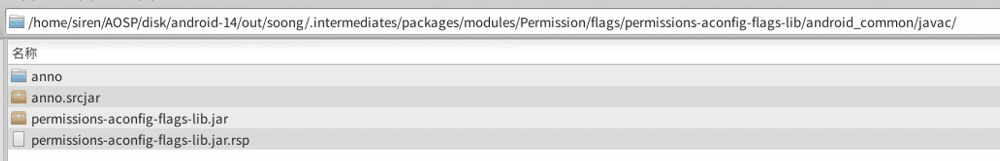


##### @role-controller.jar:
```
// android-14/out/soong/.intermediates/packages/modules/Permission/PermissionController/role-controller/role-controller/android_common_apex30/javac/role-controller.jar
implementation files('libs/role-controller.jar')
```
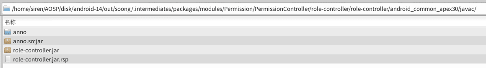


##### @safety-center-annotations.jar:
```
// android-14/out/soong/.intermediates/packages/modules/Permission/SafetyCenter/Annotations/safety-center-annotations/android_common/turbine/safety-center-annotations.jar
implementation files('libs/safety-center-annotations.jar')
```
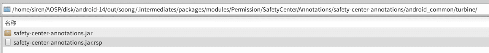


##### @safety-center-internal-data.jar:
```
// android-14/out/soong/.intermediates/packages/modules/Permission/SafetyCenter/InternalData/safety-center-internal-data/android_common_apex30/javac/safety-center-internal-data.jar
implementation files('libs/safety-center-internal-data.jar')
```
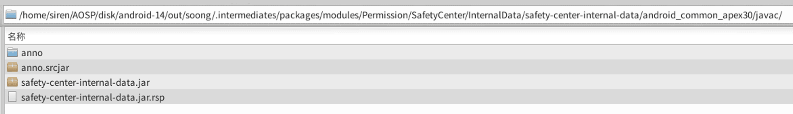


##### @safety-center-pending-intents.jar:
```
// android-14/out/soong/.intermediates/packages/modules/Permission/SafetyCenter/PendingIntents/safety-center-pending-intents/android_common_apex30/javac/safety-center-pending-intents.jar
implementation files('libs/safety-center-pending-intents.jar')
```


##### @safety-center-resources-lib.jar:
```
// android-14/out/soong/.intermediates/packages/modules/Permission/SafetyCenter/ResourcesLib/safety-center-resources-lib/android_common_apex30/javac/safety-center-resources-lib.jar
implementation files('libs/safety-center-resources-lib.jar')
```
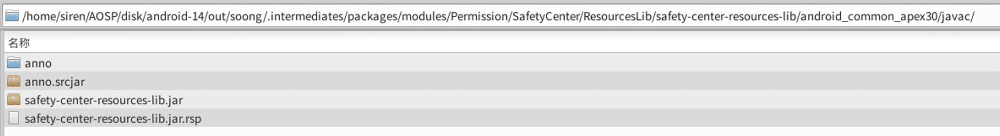


##### @safety-label.jar:
```
// android-14/out/soong/.intermediates/packages/modules/Permission/SafetyLabel/safety-label/android_common_apex30/javac/safety-label.jar
implementation files('libs/safety-label.jar')
```
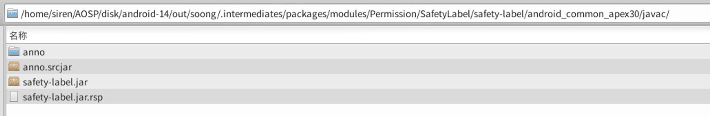


### Step 2: Add Module Dependencies
###### You need to import the code from the specific paths directly into the project as Module dependencies. During build, you can reference them via `implementation project`, or you can generate AAR files via `gradle build` and place them in the libs folder as static packages.

##### @SettingsLib: 
```
// android-14/frameworks/base/packages/SettingsLib
include 'SettingsLib:HelpUtils'
include 'SettingsLib:RestrictedLockUtils'
include 'SettingsLib:AppPreference'
include 'SettingsLib:SearchWidget'
include 'SettingsLib:LayoutPreference'
include 'SettingsLib:BarChartPreference'
include 'SettingsLib:ActionBarShadow'
include 'SettingsLib:ProgressBar'
include 'SettingsLib:CollapsingToolbarBaseActivity'
include 'SettingsLib:SettingsTheme'
include 'SettingsLib:FooterPreference'
include 'SettingsLib:RadioButtonPreference'
include 'SettingsLib:TwoTargetPreference'
include 'SettingsLib:SettingsTransition'
include 'SettingsLib:Utils'
include 'SettingsLib:SelectorWithWidgetPreference'
```
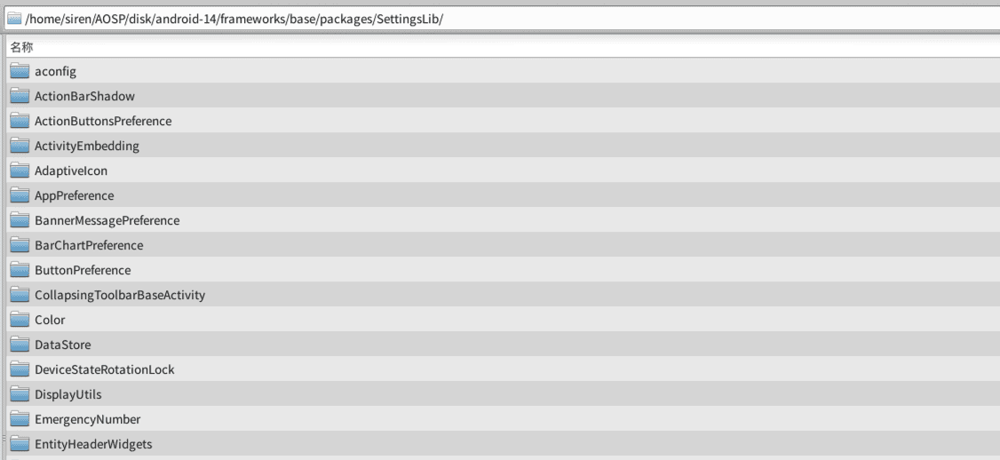


### Step 3: Extract the proto files separately as an independent directory for reference, because the proto files in the original path specify paths based on AOSP, which will cause reference failures during compilation.
```
sourceSets {
    main {
	......
	proto.srcDirs = ['protos']
	......
    }
}
```

## Generate platform.keystore Default Signature

Find the signing certificates in the android-14/build/target/product/security path and use [keytool-importkeypair](https://github.com/getfatday/keytool-importkeypair) to generate the keystore.
Execute the following command:  

```
./keytool-importkeypair -k platform.keystore -p 123456 -pk8 platform.pk8 -cert platform.x509.pem -alias platform
```

And add the following code to the gradle configuration:

```
    signingConfigs {
        platform {
            storeFile file("platform.keystore")
            storePassword '123456'
            keyAlias 'platform'
            keyPassword '123456'
        }
    }

    buildTypes {
        release {
            debuggable false
            minifyEnabled false
            signingConfig signingConfigs.platform
        }

        debug {
            debuggable true
            minifyEnabled false
            signingConfig signingConfigs.platform
        }
    }
```

---

### Related Projects
* [Settings](https://github.com/siren-ocean/Settings)
* [Launcher3](https://github.com/siren-ocean/Launcher3)
* [DocumentsUI](https://github.com/siren-ocean/DocumentsUI)
* [Camera2](https://github.com/siren-ocean/Camera2)
* [SystemUI](https://github.com/siren-ocean/SystemUI)
